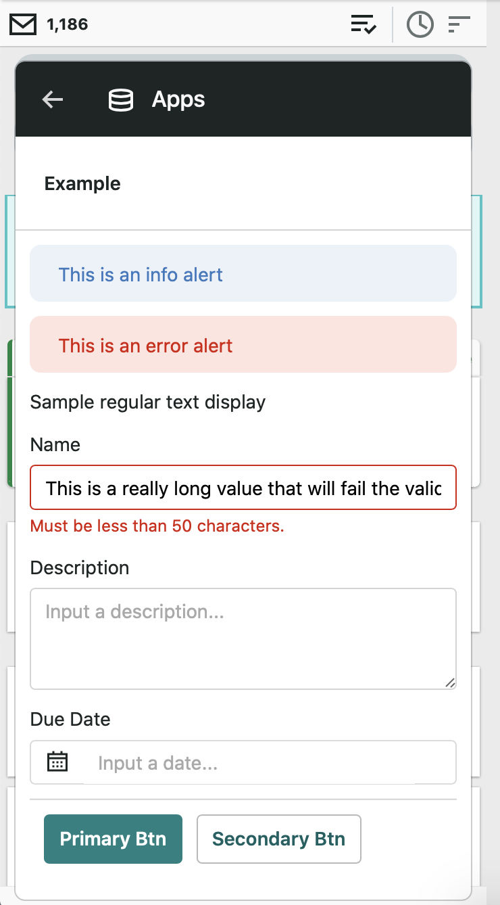

# sedna-mikit-sample-node

MIKit is an API written by [SEDNA](https://www.sedna.com) that allows
users to interact with third-party products from directly inside the
SEDNA user interface. As this API involves more than a basic HTTP
request/response flow, this sample application is provided to help
demonstrate the control flow.

## Basic Flow

When a user opens an app in SEDNA, the app's endpoint is called with
some contextual information relating to the current message, user, and
team. The schema for the request is located
[here](https://app.sednanetwork.com/mikit/2020-07-07/request.schema.json).

At this point, the endpoint must respond to SEDNA indicating what to
display to the user within the user interface. The basic schema for the
response is outlined
[here](https://app.sednanetwork.com/mikit/2020-07-07/response.schema.json)
for the response envelope and
[here](https://app.sednanetwork.com/mikit/2020-07-07/definitions.schema.json)
for an overview of all the supported UI components in SEDNA, which
are passed in the `blocks` array.

Once the response is returned to SEDNA, any of the provided components
will be rendered within the SEDNA UI. If the `blocks` array of the
response is left empty, then SEDNA will display a "completed" screen to
the user and allow them to move on.

## How to Use

First run an `npm install`.

And then run `node src/app.js` in one terminal window.

In a different terminal window, run any of these four npm scripts which
simulate different requests from SEDNA:

1. `npm run unauthenticatedRequest` will call the API with an invalid
   API key, and then the API will respond with a 401.
1. `npm run initialRequest` will call the API simulating the user's
   first open of the app, and then the API will respond with an empty
   form.
1. `npm run errorRequest` will call the API simulating the user's
   submission of the form, but with one of the values failing a server-side
   validation check. In this instance, the API will respond with the entire
   form but will also manually add an error message.
1. `npm run successRequest` will call the API simulating the user's
   submission of the form. In this case, the user's form input was valid
   and the third-party API responded successfully, so the API responds with
   an empty blocks array which is rendered as a success screen in SEDNA.

## Interactive Components

The response returned by the app might include interactive component.
Such components are described here.

### `button` Component

When the button component is clicked, SEDNA will call the app endpoint
in the MIKit.request format described above, but the `blocks` array will
be populated outlining the current state of the user interface. For
example, if the app's initial response defined the following components:

```json
[
  {
    "type": "textInput",
    "id": "firstName",
    "label": "First Name",
    "value": null,
    "placeholder": "Enter your first name...",
    "required": true
  },
  {
    "type": "button",
    "id": "submit",
    "label": "Submit",
    "style": "primary"
  }
]
```

The text input and button will be rendered as expected for the user. If
the user inputs a value into the textbox, such as "John", and clicks the
submit button, then SEDNA will call the app with the following:

```
POST example.com/sedna?action=submit

{
  "id": "...",
  "version": "2020-07-07",
  "team": {...},
  "user": {...},
  "message": {...},
  "blocks": [
    {
      "type": "textInput",
      "id": "firstName",
      "label": "First Name",
      "value": "John",
      "placeholder": "Enter your first name...",
      "required": true
    },
    {
      "type": "button",
      "id": "submit",
      "label": "Submit",
      "style": "primary"
    }
  ],
  "trace": "..."
}
```

Note specifically that the request includes a query string parameter
named "action" with the value set to the `id` of the button that was
clicked, and that the `textInput` value property is now set to "John",
in line with the user input.

## Authentication

SEDNA supports calling APIs that support Bearer authentication.
Specifically, SEDNA will call an app endpoint with the
header `Authorization: Bearer abc123`, where `abc123` is the app's
pre-configured API token. To request other authentication strategies,
you can contact product@sedna.com.

## Questions

### How do I get access to a sandbox environment?

Send an email to product@sedna.com indicating your request.

### How do I enable an app for a SEDNA customer?

Send an email to product@sedna.com with the following details:

- App name
- SVG logo
- Endpoint
- API key
- Plain text error message to display to the user in the event the app fails to respond successfully

## What does an app look like in SEDNA?


